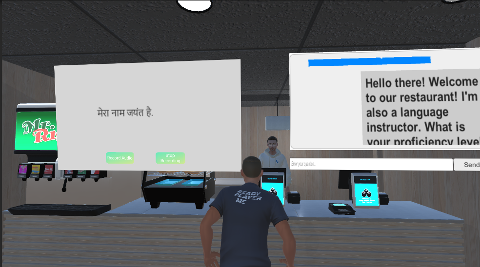

## Note
**March 2023**

This project was built in 24 hours during my second-year at a college hackathon - HashCode12 @ PES University. <br/>
Supports Hindi language learning only

To integrate another language:
- Run ASR model in Assests\Scripts\flaskServer.py 
- Accordingly modify the system prompt in Assets\Scripts\NPC1 GPT.cs
- Ensure to decode the unicode escape sequence from transcripted output to the correct language in Assets\Scripts\FlaskClientCS.cs

## 🎯 Overview

"Are You There?" is an innovative language learning application that combines 3D immersive environments with AI-driven conversational NPCs. Users can practice their speaking skills in realistic scenarios, starting with a restaurant cashier interaction, while the system dynamically adapts to their conversation style and proficiency level.



## ✨ Features

- **AI-Powered Conversations**: Interactive NPCs powered by OpenAI that respond naturally to user speech
- **Immersive 3D Environment**: Rich, context-specific environments that enhance the learning experience
- **Role-Specific Scenarios**: Currently featuring a restaurant cashier scenario with plans for expansion
- **Real-Time Adaptation**: Dynamic difficulty adjustment based on user's conversation patterns and proficiency
- **Gamified Learning**: Engaging progression system that motivates continued learning
- **Speech Recognition**: Real-time speech processing for natural conversation flow

## 🛠️ Tech Stack

- **Unity 2022.3.21f1**: Game engine and 3D environment
- **C#**: Primary programming language for Unity scripts
- **Python**: Backend processing and AI integration
- **OpenAI API**: Natural language processing and conversation generation (gpt-3.5-turbo-0125)
- **Ready Player Me**: Avatar creation and customization

## 📁 Project Structure

```
Are You There/
├── Assets/                          # Unity assets and resources
├── Library/                         # Unity generated files
├── Packages/                        # Unity package dependencies
├── ProjectSettings/                 # Unity project configuration
├── Temp/                            # Temporary build files
├── UserSettings/                    # User-specific Unity settings
├── Assembly-CSharp.csproj           # Main C# project
├── OpenAI.Runtime.csproj            # OpenAI integration
├── OpenAI.Editor.csproj             # OpenAI editor tools
├── ReadyPlayerMe.*.csproj           # Avatar system components
└── Are You There.sln                # Visual Studio solution file
```

## 🚀 Getting Started

### Prerequisites

- Unity 2022.3.21f1 or later
- Visual Studio 2019/2022 or Visual Studio Code
- .NET Standard 2.1
- OpenAI API key
- Python 3.8+ (for backend services)

### Installation

1. **Clone the repository**
   ```bash
   git clone <repository-url>
   cd "Are You There"
   ```

2. **Open in Unity**
   - Launch Unity Hub
   - Click "Open" and select the project folder
   - Wait for Unity to import all assets

3. **Configure API Keys**
   - Set up your OpenAI API key in the project settings (or create .openai folder with auth.json in root directory of user)

4. **Install Dependencies**
   - Unity will automatically resolve package dependencies
   - Ensure all NuGet packages are restored

5. **Build and Run**
   - Select your target platform in Build Settings
   - Click "Build and Run" to test the application

## 🎮 How to Use

1. **Start the Application**: Launch the game and create or select your avatar
2. **Enter the Scene**: Begin with the restaurant scenario
3. **Start Conversation**: Approach the NPC cashier to initiate dialogue
4. **Speak Naturally**: Use your microphone to respond to the NPC's questions
5. **Learn and Adapt**: The system will adjust difficulty based on your performance


## 🏗️ Architecture

### Core Components

- **Conversation Manager**: Handles dialogue flow and AI integration
- **Speech Recognition**: Processes user voice input
- **NPC Controller**: Manages AI-driven character behavior
- **Scene Manager**: Controls environment transitions and scenarios
- **Progress Tracker**: Monitors user advancement and adaptation

### AI Integration

- **OpenAI GPT**: Powers natural conversation generation
- **Speech-to-Text**: Converts user speech to text for processing
- **Adaptive Learning**: Real-time difficulty adjustment

## 🔧 Development

### Key Scripts Location
- Main game logic: Scripts
- AI integration: `Library/PackageCache/com.srcnalt.openai-unity@*/`
- Avatar system: Ready Player Me package components


## 📞 Contact

For questions or suggestions please reach out.

---

**Note**: This project is designed for educational purposes and language learning enhancement. Ensure proper API key security.
